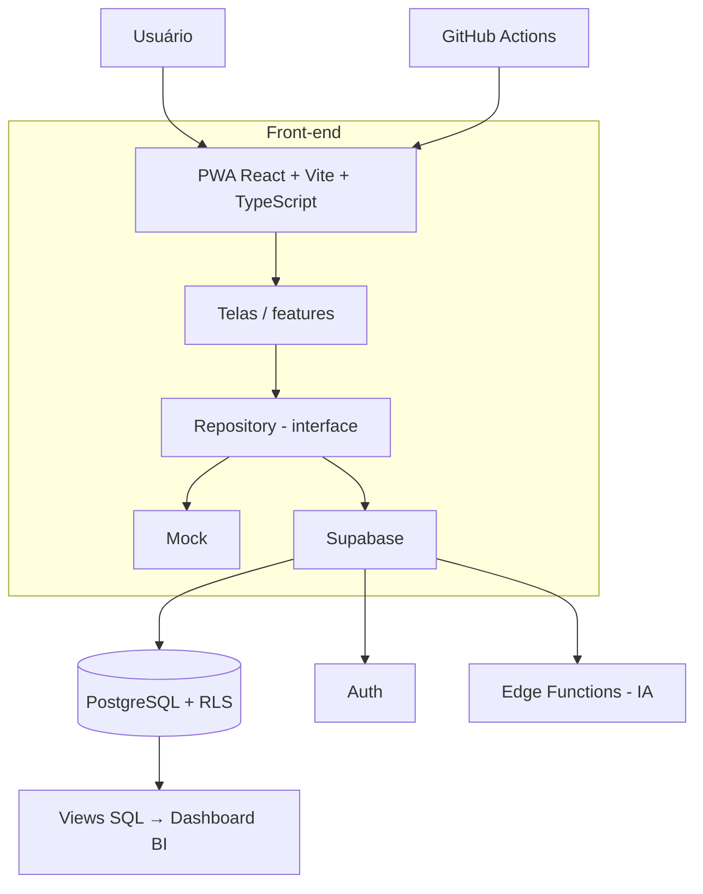

# Arquitetura (visão geral)

```mermaid
flowchart TB
  U[Usuário] --> PWA[PWA React + Vite + TypeScript]
  subgraph Front-end
    PWA --> T[Telas / features]
    T --> R[Repository - interface]
    R --> M[Mock]
    R --> S[Supabase]
  end
  S --> DB[(PostgreSQL + RLS)]
  S --> AU[Auth]
  S --> EF[Edge Functions - IA]
  DB --> BI[Views SQL → Dashboard BI]
  GH[GitHub Actions] --> PWA
```
