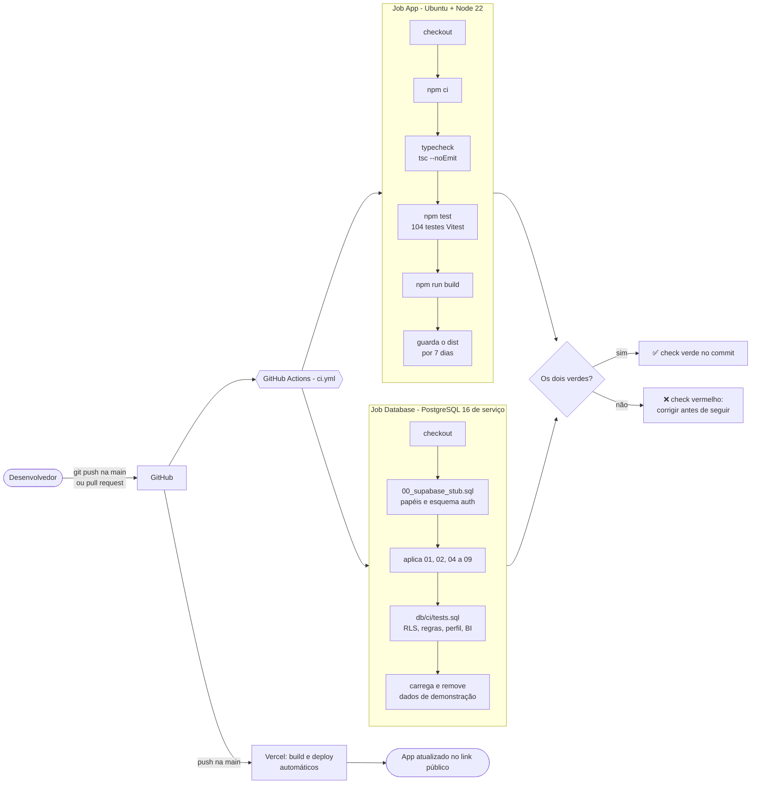
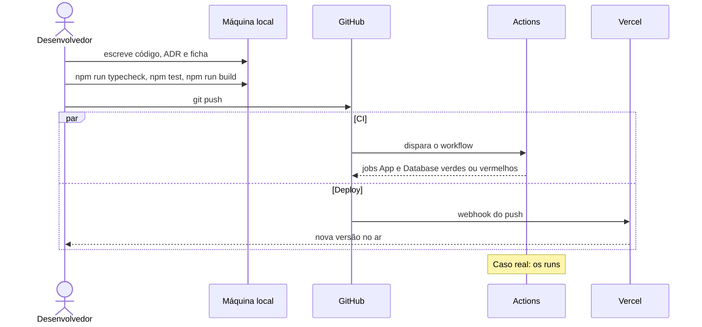

# Integração e entrega contínua (ADR-006)

## Pipeline completo

```mermaid
flowchart LR
  DEV([Desenvolvedor]) -- "git push na main<br/>ou pull request" --> GH[GitHub]
  GH --> CI{{GitHub Actions - ci.yml}}
  subgraph J1["Job App - Ubuntu + Node 22"]
    direction TB
    A1[checkout] --> A2[npm ci] --> A3[typecheck<br/>tsc --noEmit] --> A4[npm test<br/>104 testes Vitest] --> A5[npm run build] --> A6[guarda o dist<br/>por 7 dias]
  end
  subgraph J2["Job Database - PostgreSQL 16 de serviço"]
    direction TB
    B1[checkout] --> B2[00_supabase_stub.sql<br/>papéis e esquema auth] --> B3[aplica 01, 02, 04 a 09] --> B4[db/ci/tests.sql<br/>RLS, regras, perfil, BI] --> B5[carrega e remove<br/>dados de demonstração]
  end
  CI --> J1
  CI --> J2
  J1 --> R{Os dois verdes?}
  J2 --> R
  R -- sim --> OK[✅ check verde no commit]
  R -- não --> NOK[❌ check vermelho:<br/>corrigir antes de seguir]
  GH -- "push na main" --> VC[Vercel: build e deploy<br/>automáticos]
  VC --> PROD([App atualizado no link público])
```

## Ciclo de uma mudança

```mermaid
sequenceDiagram
  actor D as Desenvolvedor
  participant L as Máquina local
  participant G as GitHub
  participant A as Actions
  participant V as Vercel
  D->>L: escreve código, ADR e ficha
  D->>L: npm run typecheck, npm test, npm run build
  D->>G: git push
  par CI
    G->>A: dispara o workflow
    A-->>G: jobs App e Database verdes ou vermelhos
  and Deploy
    G->>V: webhook do push
    V-->>D: nova versão no ar
  end
  Note over A: Caso real: os runs #1 e #2 ficaram vermelhos por um<br/>caractere digitado por engano no 06_agendamento.sql.<br/>Corrigido, o run #3 ficou verde.
```
