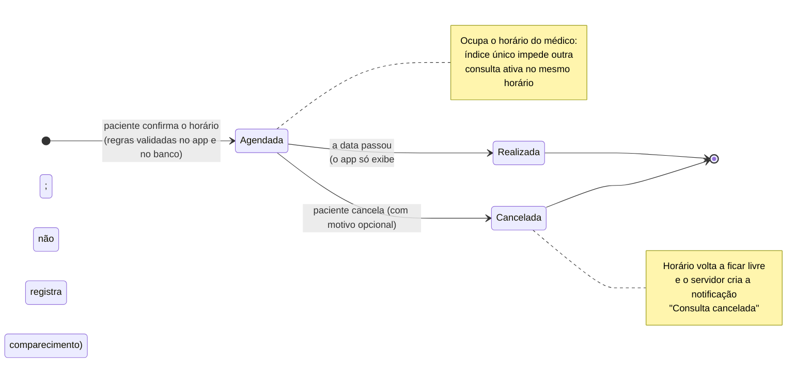
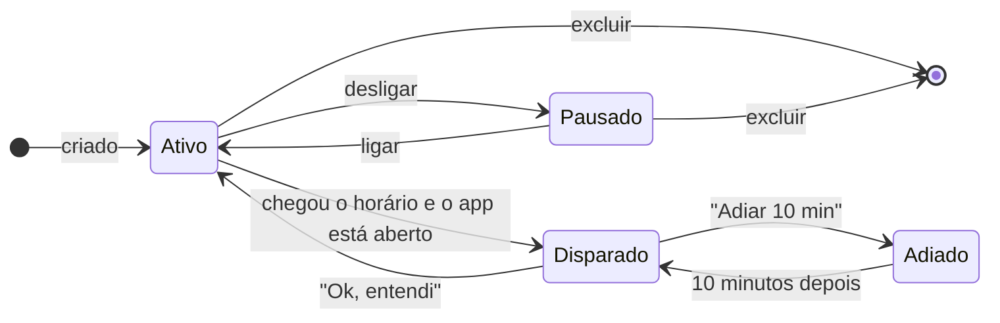
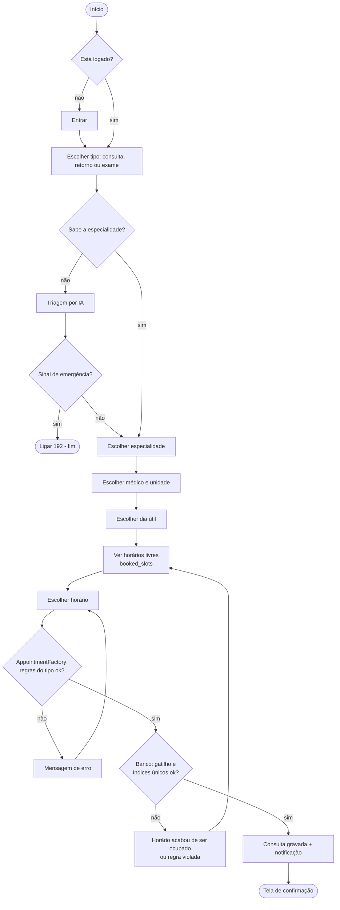
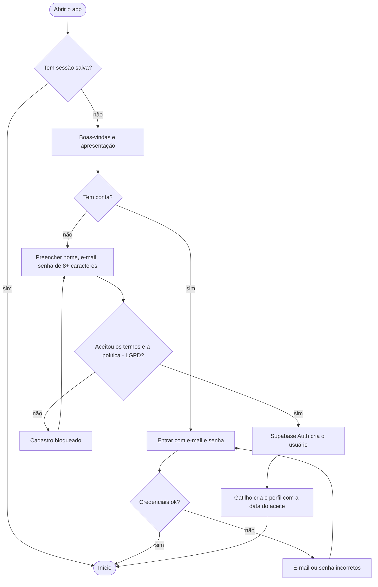

# Diagramas de estados e de atividades

## Estados de uma consulta

```mermaid
stateDiagram-v2
  direction LR
  [*] --> Agendada: paciente confirma o horário<br/>(regras validadas no app e no banco)
  Agendada --> Cancelada: paciente cancela (com motivo opcional)
  Agendada --> Realizada: a data passou<br/>(o app só exibe; não registra comparecimento)
  Cancelada --> [*]
  Realizada --> [*]
  note right of Agendada
    Ocupa o horário do médico:
    índice único impede outra
    consulta ativa no mesmo horário
  end note
  note right of Cancelada
    Horário volta a ficar livre
    e o servidor cria a notificação
    "Consulta cancelada"
  end note
```

## Estados de um lembrete

```mermaid
stateDiagram-v2
  direction LR
  [*] --> Ativo: criado
  Ativo --> Pausado: desligar
  Pausado --> Ativo: ligar
  Ativo --> Disparado: chegou o horário e o app está aberto
  Disparado --> Ativo: "Ok, entendi"
  Disparado --> Adiado: "Adiar 10 min"
  Adiado --> Disparado: 10 minutos depois
  Ativo --> [*]: excluir
  Pausado --> [*]: excluir
```

## Atividade: agendamento completo

```mermaid
flowchart TD
  A([Início]) --> B{Está logado?}
  B -- não --> L[Entrar] --> C
  B -- sim --> C[Escolher tipo: consulta, retorno ou exame]
  C --> D{Sabe a especialidade?}
  D -- não --> T[Triagem por IA] --> T1{Sinal de emergência?}
  T1 -- sim --> EM([Ligar 192 - fim])
  T1 -- não --> E
  D -- sim --> E[Escolher especialidade]
  E --> F[Escolher médico e unidade]
  F --> G[Escolher dia útil]
  G --> H[Ver horários livres<br/>booked_slots]
  H --> I[Escolher horário]
  I --> J{AppointmentFactory:<br/>regras do tipo ok?}
  J -- não --> J1[Mensagem de erro] --> I
  J -- sim --> K{Banco: gatilho e<br/>índices únicos ok?}
  K -- não --> K1[Horário acabou de ser ocupado<br/>ou regra violada] --> H
  K -- sim --> M[Consulta gravada + notificação]
  M --> N([Tela de confirmação])
```

## Atividade: cadastro e entrada

```mermaid
flowchart TD
  A([Abrir o app]) --> B{Tem sessão salva?}
  B -- sim --> H([Início])
  B -- não --> C[Boas-vindas e apresentação]
  C --> D{Tem conta?}
  D -- sim --> E[Entrar com e-mail e senha] --> E1{Credenciais ok?}
  E1 -- não --> E2[E-mail ou senha incorretos] --> E
  E1 -- sim --> H
  D -- não --> F[Preencher nome, e-mail, senha de 8+ caracteres]
  F --> G{Aceitou os termos e a política - LGPD?}
  G -- não --> G1[Cadastro bloqueado] --> F
  G -- sim --> I[Supabase Auth cria o usuário]
  I --> J[Gatilho cria o perfil com a data do aceite]
  J --> H
```
