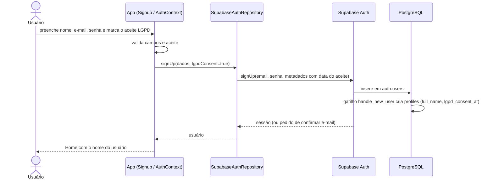

# Fluxo de autenticação e consentimento

```mermaid
sequenceDiagram
  actor U as Usuário
  participant App as App (Signup / AuthContext)
  participant Repo as SupabaseAuthRepository
  participant Auth as Supabase Auth
  participant DB as PostgreSQL

  U->>App: preenche nome, e-mail, senha e marca o aceite LGPD
  App->>App: valida campos e aceite
  App->>Repo: signUp(dados, lgpdConsent=true)
  Repo->>Auth: signUp(email, senha, metadados com data do aceite)
  Auth->>DB: insere em auth.users
  DB->>DB: gatilho handle_new_user cria profiles (full_name, lgpd_consent_at)
  Auth-->>Repo: sessão (ou pedido de confirmar e-mail)
  Repo-->>App: usuário
  App-->>U: Home com o nome do usuário
```
