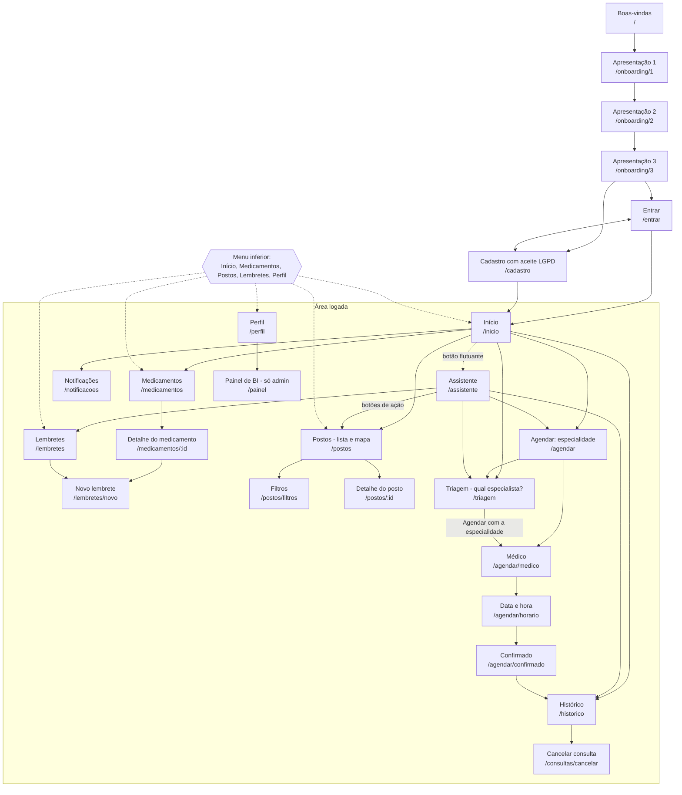

# Mapa de navegação (telas e rotas)

Cada caixa é uma tela com o seu endereço. Telas abaixo de "Área logada" exigem login (sem login, o app manda para `/entrar`).

```mermaid
flowchart TB
  W["Boas-vindas<br/>/"] --> O1["Apresentação 1<br/>/onboarding/1"] --> O2["Apresentação 2<br/>/onboarding/2"] --> O3["Apresentação 3<br/>/onboarding/3"]
  O3 --> L["Entrar<br/>/entrar"]
  O3 --> C["Cadastro com aceite LGPD<br/>/cadastro"]
  L <--> C

  subgraph Logado["Área logada"]
    H["Início<br/>/inicio"]
    M["Medicamentos<br/>/medicamentos"] --> MD["Detalhe do medicamento<br/>/medicamentos/:id"]
    MD --> RN
    P["Postos - lista e mapa<br/>/postos"] --> PF["Filtros<br/>/postos/filtros"]
    P --> PD["Detalhe do posto<br/>/postos/:id"]
    AG["Agendar: especialidade<br/>/agendar"] --> AM["Médico<br/>/agendar/medico"] --> AH["Data e hora<br/>/agendar/horario"] --> AC["Confirmado<br/>/agendar/confirmado"]
    HI["Histórico<br/>/historico"] --> CA["Cancelar consulta<br/>/consultas/cancelar"]
    RL["Lembretes<br/>/lembretes"] --> RN["Novo lembrete<br/>/lembretes/novo"]
    N["Notificações<br/>/notificacoes"]
    TR["Triagem - qual especialista?<br/>/triagem"]
    AS["Assistente<br/>/assistente"]
    PR["Perfil<br/>/perfil"] --> DB["Painel de BI - só admin<br/>/painel"]
  end

  L --> H
  C --> H
  H --> M
  H --> P
  H --> AG
  H --> HI
  H --> TR
  H --> N
  H -. botão flutuante .-> AS
  AG --> TR
  TR -- "Agendar com a especialidade" --> AM
  AS -- "botões de ação" --> P
  AS --> AG
  AS --> TR
  AS --> HI
  AS --> RL
  AC --> HI

  BN{{"Menu inferior:<br/>Início, Medicamentos, Postos, Lembretes, Perfil"}}
  BN -.-> H
  BN -.-> M
  BN -.-> P
  BN -.-> RL
  BN -.-> PR
```
